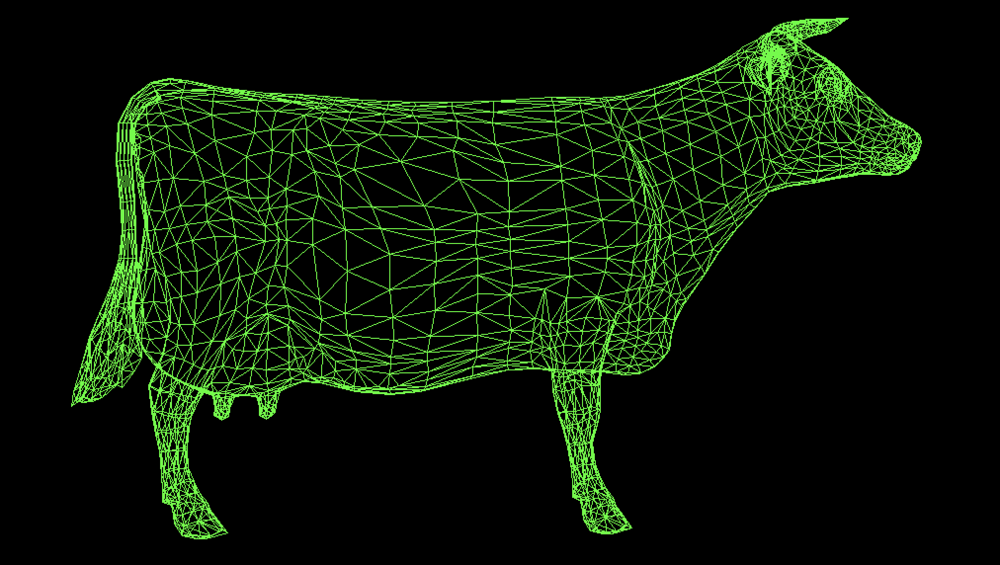
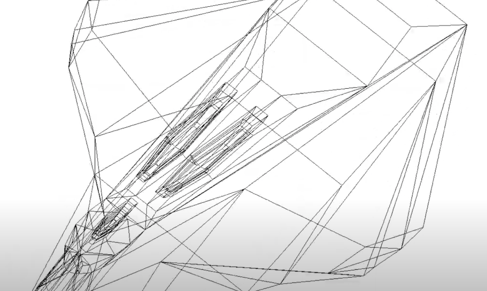
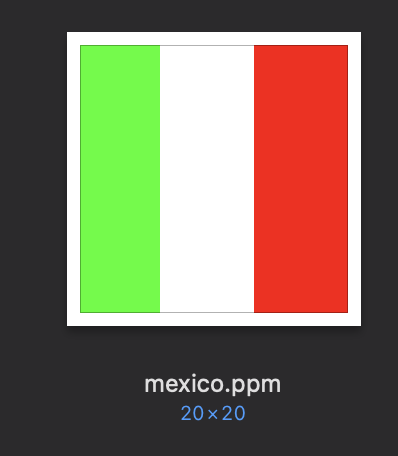

# Computer Graphics 2021

Oscar Andres Rosas Hernandez

## Practice 1: Generate lines points
Simple practice to calculate the points of a line segment using line equation.

## Practice 2: Parallel projection
Reading from an .obj as source file and drawing it in a .ppm file by making xy projection. 
Lines can be drawn using line equation, DDA or Bresenham algorithms.

## Practice 3: Animation perspective
Reading an .obj file and apply some transformations to it. Transformations are applied using 4x4 matrices (in order to use 3D Homogeneous space). Lots of frames (each frame is a .ppm file) are generated to create an animation.

## Practice 4:  Illumination
Still things to be done

## Practice 5: Surfaces
Drawing 3D surfaces using Bernstein polynomials. 

## Exercises
### PPM Mexico Creator
Generate a simple ppm file that draws a mexico flag

## YouTube channel
I'm uploading videos in this channel: https://www.youtube.com/channel/UCCUAluWPgnS40Tc8mtDQR9Q
